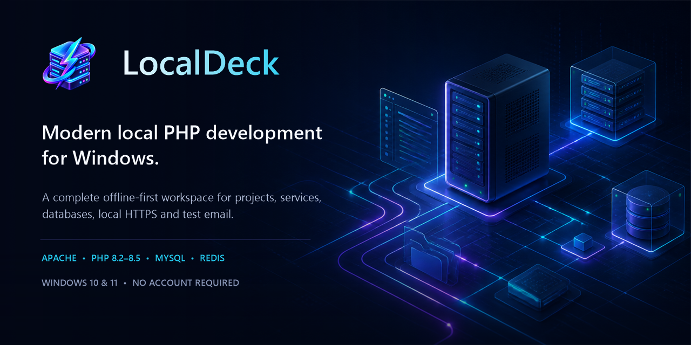
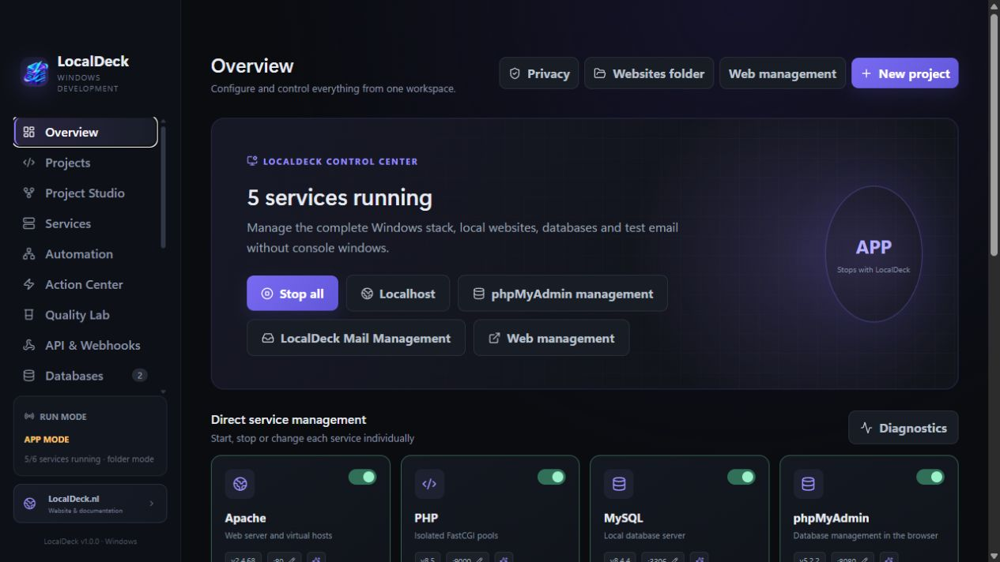
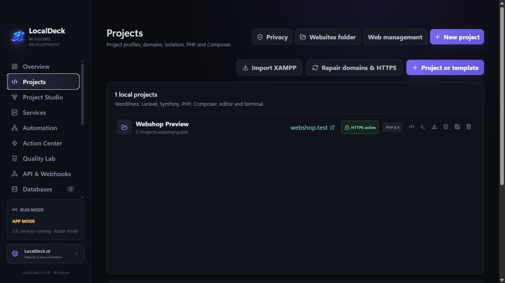

<p align="center">
  
</p>

<h1 align="center">LocalDeck</h1>

<p align="center">
  A modern, offline-first local PHP development environment built exclusively for Windows.
</p>

<p align="center">
  <a href="https://localdeck.nl/?lang=en">Website</a> ·
  <a href="https://localdeck.nl/updates.php?lang=en">Latest updates</a> ·
  <a href="https://localdeck.nl/downloads.php?lang=en">Downloads</a> ·
  <a href="https://localdeck.nl/wiki.php?lang=en">Documentation</a> ·
  <a href="https://localdeck.nl/community.php?lang=en">Community</a>
</p>

<p align="center">
  
  
  
  
</p>

LocalDeck brings a complete local web-development stack into one polished Windows desktop application. Start every service individually, manage projects and databases, create local domains with automatic HTTPS, inspect captured email, and choose whether the stack runs only with LocalDeck or as persistent Windows services.

The complete runtime is included. The standard setup requires no LocalDeck account, license key, online activation, or separate component downloads.

## Why LocalDeck?

| Local stack control | Project workflow | Safer daily development |
| --- | --- | --- |
| Start and stop Apache, PHP, MySQL, phpMyAdmin, Mailpit, and Redis separately | Create or import PHP, WordPress, Laravel, Symfony, and Drupal projects | Automatic trusted local HTTPS certificates per project |
| Change ports with validation and Port Autopilot | Use dedicated `.localhost` or `.test` domains and project-specific PHP versions | Restore points for files, databases, configuration, and captured mail |
| Run in app mode or as real Windows services | Clone Git projects and create isolated branch environments | Local diagnostics, security checks, release gates, and safe repairs |
| Open localhost, phpMyAdmin, Mail Management, and Web Management from the dashboard | Keep websites and project data together in a portable folder structure | No console windows during normal service operation |

## Included stack

| Component | What it provides |
| --- | --- |
| Apache | Local web server and virtual hosts |
| PHP 8.2–8.5 | Side-by-side runtimes and isolated FastCGI pools per project |
| MySQL | Local relational databases, users, backups, imports, and exports |
| phpMyAdmin | Browser-based database management with automatic local sign-in |
| Mailpit + LocalDeck Mail Management | SMTP capture, virtual test inboxes, search, source view, and retention controls |
| Redis | Local cache, sessions, queues, and worker workflows |
| Composer | PHP dependency management and project tasks |
| mkcert, WinSW, and supporting runtimes | Automatic local certificates and optional Windows service mode |

## Screenshots

### One control center for the complete stack



### Projects, domains, PHP versions, and HTTPS in one view



## Two runtime modes

| Mode | Behavior |
| --- | --- |
| **App mode** | Works like a traditional local stack: services run while LocalDeck is active and stop when the application is fully closed. |
| **Windows service mode** | Selected services run independently and can start with Windows. LocalDeck remains the dashboard used to configure and inspect them. |

Closing the main window can minimize LocalDeck to the Windows notification area, so the dashboard disappears without interrupting active work.

## Quick start

1. Open the [LocalDeck download page](https://localdeck.nl/downloads.php?lang=en).
2. Choose the **EXE installer** or the **ZIP extract-only package**.
3. Start LocalDeck and select app mode or Windows service mode.
4. Select **Start all** or start only the services your project needs.
5. Open `http://localhost`, your project domain, phpMyAdmin, or Web Management directly from the dashboard.

LocalDeck stores local websites in its dedicated `websites` folder. The ZIP edition can be extracted into a folder of your choice and launched through `LocalDeck.exe` without running an installer.

## Highlights

- Automatic `.localhost` and `.test` project domains
- A dedicated locally trusted certificate for every new or imported project
- Complete project cleanup with a clear confirmation before files, databases, backups, domains, certificates, and LocalDeck metadata are removed
- Port conflict detection, process ownership, safe changes, rollback, and Port Autopilot
- Database creation, inspection, users, backups, snapshots, safe SQL, schema comparison, and anonymized test data
- Local email capture with a richer management interface on top of Mailpit
- One-click project templates and XAMPP, WampServer, and Laragon migration tools
- Project capsules, start profiles, task runners, queue workers, Xdebug tools, API testing, and webhook capture
- English and Dutch interfaces across the desktop app, Web Management, Mail Management, and local start pages
- Update notifications with SHA-256 verification and atomic rollback support
- Offline runtime installation with no hidden CMD or PowerShell windows during normal use

## Downloads

LocalDeck for Windows is published in two formats:

| Download | Use it when… |
| --- | --- |
| **EXE installer** | You want the standard Windows installation wizard, shortcuts, and an installed application. |
| **ZIP extract-only** | You want to extract LocalDeck into a folder of your choice and run `LocalDeck.exe` directly. |

The newest release is always shown first, while older versions remain available from the [release archive](https://localdeck.nl/downloads.php?lang=en).

For a concise, human-readable overview of every notable change, see [Latest updates](UPDATES.md).

## Requirements

- Windows 10 or Windows 11, 64-bit
- Enough free disk space for the application, bundled runtime, databases, and projects
- Administrator approval only when Windows itself requires it, such as service registration, trusted certificate installation, or system DNS/hosts changes

## Privacy and connectivity

LocalDeck is designed for local development. Projects, databases, captured email, logs, certificates, and diagnostics remain on the computer. No LocalDeck account or activation is required. Internet access is used only for explicit online actions such as update checks, Git clones, Composer operations, or online project templates.

## Development

LocalDeck is an Electron, React, Vite, and TypeScript application. Development is Windows-first.

```powershell
pnpm install
pnpm dev
```

Run the regular project checks with:

```powershell
pnpm check
pnpm build
```

The large redistributable runtime bundles are included in the official LocalDeck downloads but are intentionally not stored in this source repository. Maintainers with the complete offline runtime workspace can additionally run `Validate-LocalDeck.ps1`. Release artifacts are produced only after that start-ready Windows workspace has passed the full validation workflow.

## Documentation and support

- [Documentation and troubleshooting](https://localdeck.nl/wiki.php?lang=en)
- [Latest product updates](https://localdeck.nl/updates.php?lang=en)
- [Questions, bug reports, and ideas](https://localdeck.nl/community.php?lang=en)
- [Windows downloads and older releases](https://localdeck.nl/downloads.php?lang=en)

LocalDeck is built for developers who want the convenience of an all-in-one local stack without giving up modern project isolation, automatic HTTPS, recoverability, and transparent service control.
